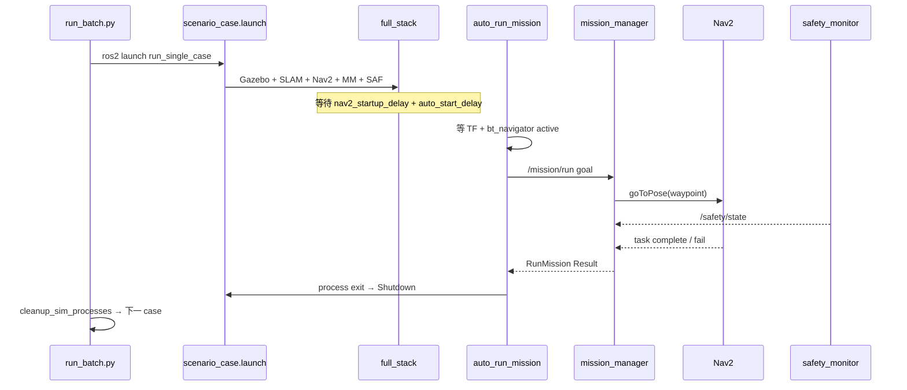

# 设计报告

**项目名称**：SE-ROS-Proj  
**日期**：2026-06-18

---

## 1. 系统架构

### 1.1 逻辑分层

```
┌─────────────────────────────────────────────────────────────┐
│  应用层：batch 脚本 / Demo 脚本 / auto_run_mission          │
├─────────────────────────────────────────────────────────────┤
│  任务层：nav2_mission_manager (状态机 + /mission/run)       │
├─────────────────────────────────────────────────────────────┤
│  安全层：sam_bot_safety_monitor (/safety/state + 服务)      │
├─────────────────────────────────────────────────────────────┤
│  规划层：Nav2 (bt_navigator + DWB + NavFn)                  │
│          + semantic_costmap_plugins (global costmap 插件)    │
├─────────────────────────────────────────────────────────────┤
│  感知/定位：SLAM Toolbox + EKF + LaserScan                  │
├─────────────────────────────────────────────────────────────┤
│  仿真层：Ignition Gazebo + ros2_control 差分驱动           │
└─────────────────────────────────────────────────────────────┘
```

### 1.2 包依赖关系

```
course_interfaces (msg/srv/action)
       │
       ├── nav2_mission_manager ──► nav2_simple_commander
       ├── sam_bot_safety_monitor
       └── course_bringup ──► sam_bot_nav2_gz
                           ├── semantic_costmap_plugins
                           └── nav2_scenario_runner
```

---

## 2. 模块设计

### 2.1 任务管理模块（FR-B）

**核心类**：

| 类/模块 | 文件 | 职责 |
|---------|------|------|
| `MissionActionServerNode` | `mission_action_server.py` | Action Server 主循环 |
| `MissionStateMachine` | `state_machine.py` | 显式 `_handle_<state>` 事件分发 |
| `BasicNavigatorAdapter` | `navigator_adapter.py` | 封装 `nav2_simple_commander` |
| `load_mission_file` | `mission_loader.py` | JSON → WaypointSpec |

**状态机（节选）**：

```
IDLE → LOADING_MISSION → WAITING_FOR_NAV2 → DISPATCHING_GOAL
     → WAITING_FOR_RESULT → (成功) 下一 waypoint / MISSION_SUCCEEDED
                          → (失败) RETRYING / MISSION_FAILED
                          → (安全) PAUSED_FOR_SAFETY / CANCELING_FOR_SAFETY
```

**TransitionCommand**：`WAIT_FOR_NAV2` | `SEND_GOAL` | `CANCEL_GOAL` | `NONE`

**安全暂停链**：收到 STOP_NOW → cancel Nav2 → 可选后退 + 清 costmap → 等待 SAFE 持续 hold 时间 → 重发 goal。

### 2.2 场景生成模块（FR-A）

**C++ 插件架构**：

```
generate_scenario_node (ROS node)
    └── GeneratorRegistry (pluginlib)
            ├── CorridorGenerator
            ├── RoomInspectionGenerator
            ├── CongestionGenerator
            └── FaultInjectionGenerator
                    └── ScenarioSerializer → YAML/JSON
```

**Python 流水线**：

1. `generate_cases.py` — 读 `batch_profiles/*.yaml`，调 C++ node
2. `run_batch.py` — 顺序 launch 单 case，写 log/json
3. `summarize_results.py` — 汇总 CSV

**Case 产物**：

| 文件 | 内容 |
|------|------|
| `{id}_scenario.yaml` | walls、waypoints、semantic regions |
| `{id}_mission.json` | mission_manager 任务 |
| `{id}_semantic_overlay.yaml` | Nav2 参数 overlay（zones 注入） |

### 2.3 语义 Costmap 模块（FR-C）

**插件链（global_costmap）**：

```
ObstacleLayer → SemanticZoneLayer → InflationLayer
              (PreferredLaneLayer / DynamicCongestionLayer 可选)
```

**SemanticZoneLayer 设计要点**：

- 从 ROS 参数加载 `zones`（圆/多边形/旋转矩形）
- 订阅 `/semantic_task_mode` 过滤参与 zone
- `updateCosts` 遍历 master grid，按 `merge_strategy` 融合

**DynamicCongestionLayer**：

- 订阅 `/semantic_congestion_events`
- 圆形区域空间衰减 + TTL 生命周期（默认 8s）

### 2.4 安全监控模块（FR-D）

**SafetyMonitor 定时器链**（200ms）：

```
_check_tf → _check_sensor_timeout → _check_obstacle_proximity
         → _check_blockage → _check_recovery_window
```

**状态映射到 Mission**：

| Safety 内部状态 | SafetyState.level | Mission 行为 |
|-----------------|-------------------|--------------|
| NORMAL | SAFE | 正常执行 |
| RECOVERING | SLOW_DOWN | 等待恢复窗口 |
| PAUSED / ESTOP / CANCELED | STOP_NOW | cancel Nav2 goal |

**spin 脱困保护**：`_is_spinning_in_place()` 为 true 时跳过 `_check_blockage()`。

### 2.5 集成 Launch 设计

**scenario_case.launch.py**：

1. Include `full_stack.launch.py`（Gazebo + SLAM + Nav2 + mission + safety）
2. `TimerAction(auto_start_delay)` → `auto_run_mission.py`
3. `OnProcessExit(auto_runner)` → `Shutdown` 整栈

**complete_navigation.launch.py**：

1. `display.launch.py` → diff_drive ready
2. `slam_toolbox` online_async
3. `TimerAction(50s)` → `nav2_bringup/navigation_launch.py` + RViz
4. `nav2_params_utils.patch_nav2_params()` 注入自定义 BT 路径

---

## 3. 接口设计

### 3.1 Action

**`/mission/run`**（`RunMission.action`）

| 字段 | 方向 | 说明 |
|------|------|------|
| `mission_file` | Goal | JSON 路径 |
| `max_retry_per_waypoint` | Goal | 每点最大重试 |
| `allow_skip_waypoint` | Goal | 失败是否跳过 |
| `success`, `completed_waypoints`, `final_state` | Result | 执行结果 |
| `current_waypoint_index`, `current_state` | Feedback | 进度 |

### 3.2 关键 Topic

| Topic | 类型 | 说明 |
|-------|------|------|
| `/mission/state` | MissionState | 任务进度 |
| `/safety/state` | SafetyState | level: SAFE/SLOW_DOWN/STOP_NOW |
| `/plan` | nav_msgs/Path | RViz 绿线规划路径 |
| `/semantic_task_mode` | std_msgs/String | 语义层模式过滤 |
| `/semantic_congestion_events` | Float32MultiArray | 动态拥堵事件 |

### 3.3 安全服务

- `/safety/get_safety_state`
- `/safety/trigger_pause`
- `/safety/trigger_emergency_stop`
- `/safety/trigger_cancel`
- `/safety/request_recovery`

---

## 4. Nav2 与 Recovery 设计

**自定义行为树**（`sam_bot_nav2_gz/config/behavior_trees/`）：

Recovery 顺序（RoundRobin）：

1. Clear local + global costmap
2. Backup 0.25m → Spin **180°**（CW，`spin_dist=3.14159`）
3. Backup 0.25m → Spin **180°**（CCW）
4. Wait 2s

**behavior_server 参数**：

- `max_rotational_vel: 0.45`
- `min_rotational_vel: 0.18`
- `rotational_acc_lim: 1.0`
- Spin `time_allowance: 25`（适配慢速 180° 旋转）

---

## 5. 数据流（Batch 单 Case）



---

## 6. 配置设计

| 配置文件 | 用途 |
|----------|------|
| `nav2_params.yaml` | 基线 Nav2（DWB + NavFn） |
| `nav2_params_semantic.yaml` | 启用 SemanticZoneLayer 等 |
| `mission_manager.yaml` | goal_timeout、nav2_ready_timeout |
| `safety_monitor.yaml` | 堵塞/spin 忽略/传感器阈值 |
| `default_batch.yaml` | README 默认 batch（2 个 pillar case） |
| `full_batch.yaml` | 四场景全量 batch（含 congestion/fault） |

---

## 7. AI 辅助开发设计约定

- **【AI-SCOPE】**：仅生成 import、declare、类/函数空壳、pluginlib 注册
- **【AI-PROMPT】**：记录在文件头，供课程审计
- **TODO[姓名]**：自研业务逻辑标记，代码审查时区分 AI 骨架与手写实现

详见 `06_SBOM与代码说明.md` 第四节。
